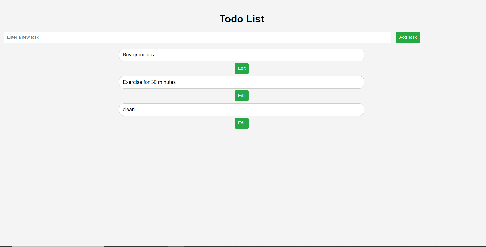
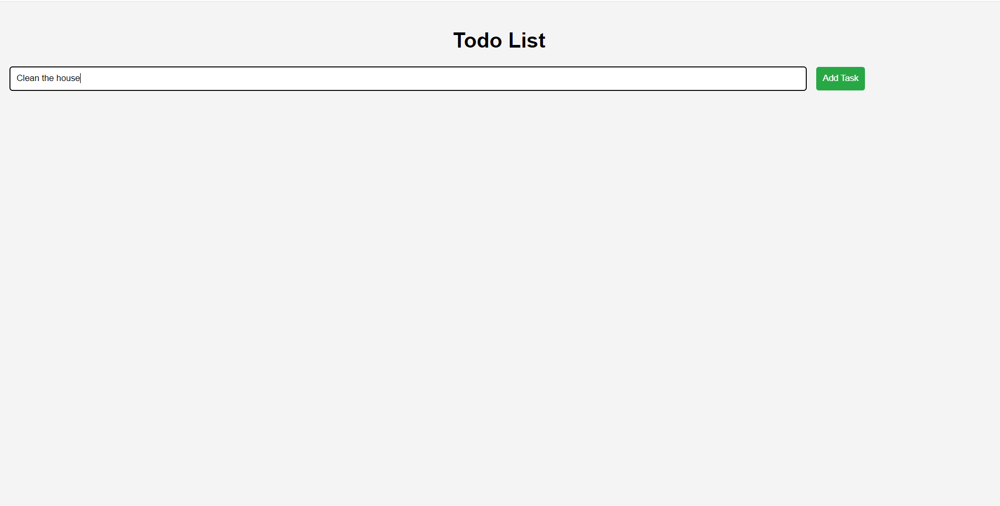
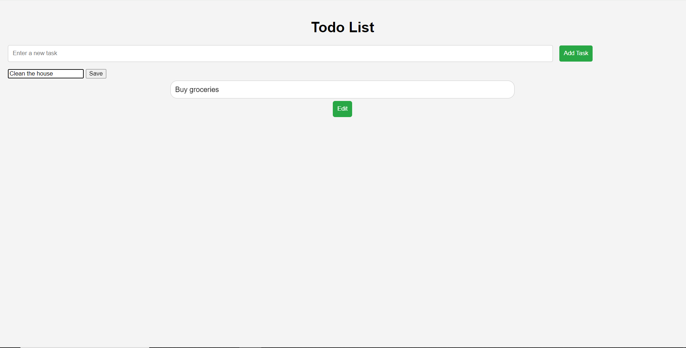

# Todo List App

This is a simple Todo List application built using HTML, CSS, and TypeScript.

## Features

- Add new tasks to the list
- Remove tasks by clicking on them
- Edit task 
## Instructions

1. Open `index.html` in a web browser.
2. Enter a new task in the input field and click the "Add Task" button.
3. Click on a task in the list to remove it.

## Screenshots

### Main Interface

*The main interface of the Todo List app, where you can add new tasks and see the list of tasks.*

### Adding a New Task

*Entering a new task in the input field and clicking the "Add Task" button to add it to the list.*

*Entering a new task in the input field and clicking the "Save" button edit the existing task.*

## Running the Application

To run the application, simply open the `index.html` file in your web browser.

